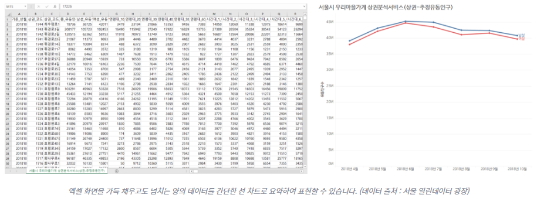

# 데이터시각화 강좌 소개
- 과목: 데이터시각화
- 교수: 신해웅(logistex@hywoman.ac.kr)

## 1. 데이터시각화?
### 1.1 [코로나 맵](http://livecorona.co.kr)
  
### 1.2 [공공데이터](https://www.data.go.kr/)
  
### 1.3 [대시보드](http://www.dbguide.net/)
  
### 1.4 [항만별 물동량](http://www.mof.go.kr/article/view.do?articleKey=20617&boardKey=2&currentPageNo=1)
  
## 2. 왜 배워야 하나?
- 190122, [뉴스젤리](http://newsjel.ly), [당신도 데이터 시각화를 해야 하는 5가지 이유](http://newsjel.ly/archives/newsjelly-report/visualization-report/8136)
### 2.1 한눈에 보이는
  
  
### 2.2 영감을 주는
  
### 2.3 통계의 함정
  
### 2.4 판단을 위해서
  [빅데이터를 활용해 기업 문제 해결한 사례](https://m.post.naver.com/viewer/postView.nhn?volumeNo=19868462&memberNo=35871176)
  
### 2.5 창의적 활용
  
  

## 3. 무엇을 배워야 하나?
### 3.1 범위
  
  - 정보 시각화
  - [인포그래픽](https://m.blog.naver.com/PostView.nhn?blogId=minwook74&logNo=120192372471&proxyReferer=https%3A%2F%2Fwww.google.com%2F)
    
    
    
  - 데이터 시각화
### 3.2 절차
  
  
### 3.3 도구
  
  

  - [데이터 분석, R로 시작할까 파이썬으로 시작할까?](http://media.fastcampus.co.kr/knowledge/dataanalysis-python-r/)
  
  
  - 190619, [Coding World News](www.codingworldnews.com), [“파이썬 vs. R” 데이터 사이언스에 더 적합한 언어는?](https://www.codingworldnews.com/article/view/1100)
  
  - 180131, [Data-Driven Science](https://medium.com/@data_driven?source=post_page-----3ebb1a968197----------------------), [Python vs R for Data Science: And the winner is..](https://medium.com/@data_driven/python-vs-r-for-data-science-and-the-winner-is-3ebb1a968197)
  
### 3.4 파이썬
- 파이썬 라이브러리 개괄
  - <b>Matplotlib</b>
    모든 파이썬 라이브러리의 엄마같은 존재,
    다른 도구를 활용하기 위한 기반 역할을 하는 라이브러리
    
  - <b>Seaborn</b>
    더 복잡한 시각화 접근을 가능하게 해주지만,
    섬세하게 다듬기 위해서는 matplotlib에 관한 지식이 여전히 필요함
    
  - <b>Bokeh</b>
    당신만의 시각화 서버를 구축하기 위한 견고한 도구이지만,
    단순한 시나리오를 작성해야 하는 상황이라면 너무 과한 도구
    
  - <b>Geoplotlib</b>
    지리적 데이터에 관한 시각화 도구
    
  - <b>ggplot</b>
    쓸만하지만, 아직도 발전하고 있는 도구
    
  - <b>Plotly</b>
    상호작용성이 가장 뛰어난 그래프를 생성할 수 있으며,
    멋진 웹 기반 시각화를 위하여 결과를 오프라인으로 저장할 수 있음
    
- 용도에 맞는 프레임워크 선정
  - <b>인공 신경망</b>
    대부분의 튜토리얼이 matplotlib를 사용하고 있으며,
    matplotlib라는 범용 시각화 도구는 다른 도구를 적용하기 위한 기반의 역할에 적합함
  - <b>회귀 및 분류 모델</b>
    회귀 또는 분류 작업에서는 주로 Seaborn을 사용하는데,
    Seaborn에서 상관 행렬(correlation matrix)을 제공하기 때문임
  - <b>주가 변동 표시기</b>
    데이터 변동을 실시간으로 표시하고,
    사용자가 차트 위로 커저를 옮길 때 실시간으로 반응해야 하는 상황,
    주로 Plotly 또는 Bokeh를 사용하며, 둘 다 자바스크립트를 지원함
  - <b>지도</b>
    PostgreSQL, MongoDB 및 JSON 형식 파일에 지리 정보를 저장해 두고,
    지도와 관련한 데이터를 표시해야 한다면,
    Geoplotlib 프레임워크를 추천함
  - <b>통계학 응용 연구</b>
    제약회사의 임상 실험 등의 상황에서는 전통적으로 R 도구가 애용되었으나,
    최근에는 Python 도구 활용이 늘어나는 추세이며, ggplot 또한 추천 대상임
- 180824, Seongyun Byeon, [Python에서 데이터 시각화하는 다양한 방법](https://zzsza.github.io/development/2018/08/24/data-visualization-in-python/) 
  - 파이썬에서 자주 쓰는 데이터 시각화 라이브러리
  - 다양한 차트 예제
  - 간단한 코드 예제
  - 충실한 원 자료 링크
  - 이 기사에서 링크하고 있는 [누구나 쉽게 이해할 수 있는 Git 입문](https://backlog.com/git-tutorial/kr/intro/intro1_1.html) 공부하기를 강추 
- 190325, Zeming Yu, [My top 10 Python packages for data science](https://towardsdatascience.com/my-top-10-python-packages-for-data-science-2dee7f3dee94)
  - 데이터 처리
    - pandas
      데이터 정렬, 병합, 필터링, ...
      [Python for Data Analysis](https://www.oreilly.com/library/view/python-for-data/9781491957653/)
    - numpy
      pandas 개발의 기반 역할을 한 패키지로서, 기본적 데이터 조작을 위한 패키지
      연령에 근거해서 은퇴여부라는 새로운 열을 생성하려면,
      `df['은퇴여부'] = np.where(df['연령']>=65, 'yes', 'no')`
    - qgrid
      쥬피터 노트북에서 데이터프레임을 정렬, 필터, 편집하기 위한 멋진 패키지
  - 그래프 작성
    - matplotlib
      모든 종류의 그래프 작성에 유용한 패키지로서,
      쥬피터 노트북에서 작성한 그래프가 출력되도록 하려면 다음 코드 라인을 실행해야 함
      `%matplotlib inline`
    - seaborn
      matplotlib로 작성한 그래프를 더욱 멋지게 보이도록 해주는 패키지
    - plotly
      사용자와 상호작용하는 그래프를 쥬피터 노트북에서 작성하도록 해주는 패키지
  - 모델링
    - statsmodels
      보험계리사가 사용하는 Generalized Linear Model(GLM) 작성, 시계열 분석 및
      기타 통계적 모델링 기능을 제공하는 패키지
    - scikit-learn
      기계학습의 주력 패키지로서,
      분류, 회귀, 군집화 및 차원 축소 등의 모든 기계 학습 작업을 수행할 수 있음
    - lightgbm
      Gradient Boost Machine(GBM)을 위한 기계 학습 패키지
    - lime
      기계학습의 모델 해석 패키지로서, 모델 예측과 예측의 주요 인자 분석에 사용됨

### 3.5 데이터 과학 코스

## 4. 알아야 할 원리는?
### 4.1 다양한 차트 유형
  

### 4.2 선택 기준
- 190302, Sandra Durcevic, [How to Choose the Right Data Visualization Types](https://www.datapine.com/blog/how-to-choose-the-right-data-visualization-types/)
- 어떤 유형의 차트를 사용할 것인가?
  - 스토리 텔링의 관점에서 고민해야 함
  - 누구에게, 어떤 메시지를 전달할 것인가를 고민해야 함
  - 최종적으로 얻어 내고자 하는 성과를 고려해야 함

#### 4.2.1 데이터 시각화 유형 12 종
  1. number chart
       - 특정 KPI 변동을 보여줄 때
       - 많은 종류를 나열하면 곤란
       - 등락의 비교 기준이 동일해야 함
    
  2. line chart
       - 시간에 따른 추세성, 경향성, 등락성을 보여줄 때
       - 너무 많은 선(변수)은 곤란
       - y 축 최대값이 데이터 최대값과 근접하도록
    
       - 이중 y 축 (범례에 주목)
    
  3. (choropleth) map
        - choropleth map: 지리적 데이터에서 특정 값의 단계를 색상으로 구분하여 표시
        - bubble map: 특정 위치에 크기로 구분한 원을 표시
        - 지도 위에 매우 많은 점을 찍어 놓은 형식은 비추
    
  4. waterfall chart
        - 정적이지만, 시간 흐름이나, 진행 단계에 따른 증감을 구분하여 표시할 때
        - 정적인 데이터는 waterfall chart가 적당하지만,
          동적인 데이터는 stacked bar chart가 적당함
    
  5. bar graph
       - horizontal bar graph
          순위 비교에 적당함, 데이터 레이블이 긴 경우에도 유용함
          항목의 순서에 의미가 있도록
    
       - column graph
          시간 순서 데이터를 표현하는 표준적 방법
          범주에 따른 데이터를 비교하는 표준적 방법
          국가별, 판매 채널별 판매량
    
       - stacked column chart
          전체-부분 관련성을 표시하는 방법
          합계값 자체보다는 상대적 비중(백분율)을 비교하여 표시
          단일 항목에 대해서라면 pie chart로 비중을 표시해야 함
          항목이 너무 많아지면, 막대가 얇아져서 어색해짐
    
  6. pie chart
       - 조각별 비중을 합한 전체가 100%가 될 때
       - 비중 수치의 정밀도가 문제된다면 stacked bar chart가 좋음
       - 압도적 비중인 항목을 강조할 때
       - 경향성 및 추세성을 강조할 때는 적합하지 않음
    
  7. guage chart
       - dial chart, speedometer chart
       - 바늘과 색상으로 구분하는 구역
       - 단일 수치로 표현되는 핵심 경영 지표를 표시할 때
       - 단일 지표의 한계로 인해 경향성 및 추세성을 표현하기 어려움
     
  8. scatter plot
       - 대용량 데이터 셋 내부의 상관관계를 표시할 때
       - 독립변수를 x 축에, 종속변수를 y 축에 표시하고, 추세선도 함께 표현
       - 데이터 셋이 많고, 상관관계가 있는 경우에만 권장
     
  9. spider chart
       - radar chart
       - 다변량 데이터의 균형감 비교를 위한 차트
       - 축 단위가 동일해야 함
       - 변수가 5개 초과하여 많아지면 이해하기 어려워짐
     
  10. tables
      - 실질적으로 시각화 도구가 아님
      - 여러 개의 정확한 수치와 단위를 표시하기 위하여 사용
      - 독자가 자신의 정확한 수치를 확인하고 싶어하는 경우에 사용
      - 독자가 읽어야 한다는 상황에 짜증을 낸다면 좋지 않음
     
  11. area chart
      - line chart와 유사하게, 시계열 관계에 기반함
      - 개별 수치보다는 추세성 및 경향성을 강조할 때 권장
      - 층으로 쌓여서 전체-부분의 비중 관계를 가질 때가 아니라면 권장하지 않음
      - 층이 겹치는 경우 곤란
     
  12. bubble chart
      - 다수 값의 대소 관게를 한눈에 비교할 수 있도록 하는 방식
      - 아래 차트에서는 가전 제품의 주문량 및 이윤율을 동시에 표시하고 있으며,
        높게 위치할수록 주문량이 많고, 원이 클수록 이윤율이 크다는 의미임
      - 버블의 면적이 중요하지, 지름이 중요한 것이 아니라는 점에 주의
     
- 차트에 멋진 텍스트 박스를 추가하여 마무리 하기
    
#### 4.2.2 체크 리스트 7종
  
  1. 어떤 스토리를 전달하려고 하는가?
    데이터 스토리-텔링에 관해서, [dashboard presentation](https://www.datapine.com/blog/dashboard-storytelling-with-kpis-presentation-examples/) 지침을 참고
       - 데이터 시각화로 시작하라.
       - 독자를 최우선으로 존중하라.
       - 공허한 말(기술)을 내세우지 말라.
       - 스토리-텔링의 위력을 활용하라.
       
  2. 누구를 향해 말하는가?
     - 독자(청중)에 대해 연구하라.
     - [누가 나의 청중인가?](https://www.thecmethod.com/podcast/standoutgetnoticed/how-well-do-you-know-your-audience-episode-201/)
  3. 추세(경향)에 대한 분석인가?
     - line chart
     - column chart
     - area chart
  4. 데이터의 구성 비율에 대한 분석인가?
     - pie chart
     - spider(radar) chart
     - bar chart
     - columned visualization
     - scatter plots
  5. 여러 값 집합을 비교하려는가?
     - bubble chart
     - spider chart
     - bar graph
     - columned visualization
     - scatter plots
  6. 시간 축이 필요한가?
     - [dynamic line chart](https://canvasjs.com/jquery-charts/dynamic-live-line-chart/)
     - bar chart
  7. KPI(핵심 성과 지표)가 문제인가?
     - 관계성을 보여주거나 비교하려고 하는가?
     - 경향성을 보여주려는가?
### 4.3 추천 자료
- 180118, SD아카데미, [빅데이터 시각화 종류 및 도구 정리](https://m.blog.naver.com/PostView.nhn?blogId=sundooedu&logNo=221187706618&proxyReferer=https%3A%2F%2Fwww.google.co.kr%2F)
- 140428, kingdom99, [02. 데이터 시각화의 기본 원리](http://www.dator.co.kr/osung/textyle/982148)
- 140602, kingdom99, [03. 다양한 데이터 시각화의 표현 방법](http://www.dator.co.kr/osung/textyle/982148)
- 170401, 송한나, [The Art of Data - 2회 이럴 땐 이런 그래프: 데이터에 맞는 시각화 방법](https://www.cognitumlab.com/single-post/2017/10/08/The-Art-of-Data-2회-이럴-땐-이런-그래프-데이터에-맞는-시각화-방법)
- 190725, 임월드, [데이터 시각화 종류 (기초) _ matplotlib(seaborn)](https://imworld.tistory.com/entry/데이터-시각화-종류-기초-matplotlibseaborn)
- ?, Qlik Sense, [목적에 적합한 유형의 시각화 사용](https://help.qlik.com/ko-KR/sense/November2019/Subsystems/Hub/Content/Sense_Hub/Visualizations/when-to-use-visualizations.htm)
- ?, tableau, [데이터 시각화 현장 가이드: 정의, 예제, 학습 리소스](https://www.tableau.com/ko-kr/learn/articles/data-visualization)

- [5 Types of Big Data Visualization Categories](https://www.klipfolio.com/resources/articles/what-is-data-visualization)
- [THE TOP 10 TYPES OF DATA VISUALIZATION MADE SIMPLE](https://www.boostlabs.com/10-types-of-data-visualization-tools/)
- [Top 16 Types of Chart in Data Visualization](https://towardsdatascience.com/top-16-types-of-chart-in-data-visualization-196a76b54b62)  (상호작용형 차트 예시)
- [Data Visualization: Visualization Types](https://guides.library.duke.edu/datavis/vis_types)
- 190302, Sandra Durcevic, [How to Choose the Right Data Visualization Types](https://www.datapine.com/blog/how-to-choose-the-right-data-visualization-types/) 

- 140314, 도나 M. 웡, [월스트릿저널 인포그래픽 가이드](http://www.yes24.com/Product/Goods/12292773), 인사이트 

## 5. 강의 및 평가 계획
### 5.1 강의 계획
- 공식 교재: 171229, 민형기, [파이썬으로 데이터 주무르기](http://www.yes24.com/Product/Goods/57670268), 비제이퍼블릭
- 강의 노트: 200000, 신해웅, [https://github.com/logistex/vd](https://github.com/logistex/vd)
- 강좌 내용 구성
  - 강좌 소개 및 준비
    1. 강좌 소개 (이번 강의)
    2. [실습 환경 구축](./vd_memo.md)
       - [Anaconda 설치 안내](./anaconda_설치_안내서.md)
       - [Anaconda 가상환경 관리](./conda_vnv.md)
  - 교재 실습
    3. [CCTV 설치 규모 분석](./DataScience/source_code/01._인구대비_CCTV_설치량_분석.ipynb/)
  
    4. [범죄 빈도 분석](./DataScience/source_code/02._Analysis_for_crime_in_Seoul.ipynb)
  

  - 장고 데이터 시각화
    5. [Highcarts With Django](./highchartsWithDjango/장고에서_차트_그리는_방법.md)
      
      
    6. [Mapbox with Django](./mapboxWithDjango/mapboxWithDjango.md)
      
    7. [GeoDjango by Ahmed](./geo/geo_by_Ahmed.md)
      
      
    8. [map with Django by Hakim](./mapWithDjango/mapWithDjango.md)
      
    - [D3 Map with Django](./d3mapWithDjango/d3mapWithDjango.md)
    - [장고 지도 관련 참고 자료 목록](./map_ref.md)

  - Dashboard
    9. 200212, Veronika Rovnik, [How to create an analytics dashboard in a Django app](https://www.freecodecamp.org/news/how-to-create-an-analytics-dashboard-in-django-app/)
    
    - [Welcoming Dash 1.0.0](https://medium.com/plotly/welcoming-dash-1-0-0-f3af4b84bae)
    - [django-dash](https://github.com/barseghyanartur/django-dash)
    10. 200117, Sm0ke, [Django Dashboard - Learn by Coding](https://dev.to/sm0ke/django-dashboard-learn-by-coding-437l)
      
    11. 190312, David Comfort, [How to Build a Reporting Dashboard using Dash and Plotly](https://towardsdatascience.com/how-to-build-a-complex-reporting-dashboard-using-dash-and-plotl-4f4257c18a7f#4711)
    12. 160618, Clinton Dreisbach, [Building dashboards with Django and D3](https://dreisbach.us/articles/building-dashboards-with-django-and-d3/)
### 5.2 평가 계획

구분 | 배점 | 평가의 초점 |
--- | ---: | :---: |
출석 |  15 | 성실성
중간 |  25 | 기본 개념의 이해 및 전반적 흐름의 파악
기말 |  30 | "
평소 |  40 | 문제 해결 능력 및 의지
합계 | 100 |

## 6. 마무리
- 이번에 공부한 내용
  - 데이터 시각화란 무엇인가?
  - 왜 배워야 하나?
  - 무엇을 배워야 하나?
  - 알아야 할 원리는?
  - 강의/평가 계획
- 다음에 공부할 내용
  - 실습 환경 구축
  - CCTV 설치 규모 분석

